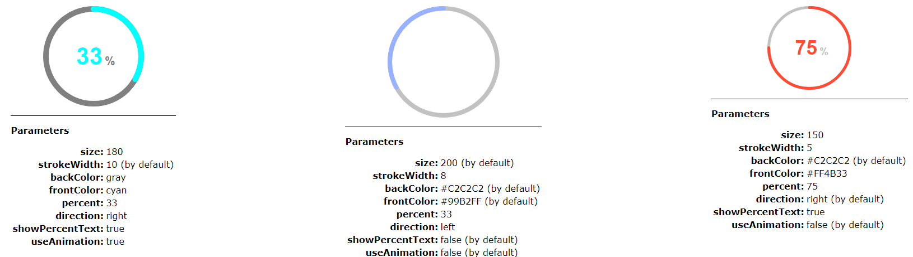

# ProgressRingDemo

---

This component shows a ring with two circles, one is filled with a percent defined as a parameter.

Parameters:

* **size**: The diameter of the ring
* **strokeWidth**: Width of the stroke for the circles of the ring. This value is part of the size of the ring. E.g., in a component with a size of 100 and a stroke width of 5, the outer diameter of the ring is 100 and the inner diameter is 90 (100 - (5 * 2))
* **backColor**: Color for the circle as the background of the ring
* **frontColor**: Color for the circle that shows the percentage value of the ring
* **percent**: Percentage to show in the ring
* **direction**: Direction that the circle of percentage must to grow. This value can be *right* or *left*. If it's *right*, the circle will be grown in the same way of the clock needles, otherwise, if the value is *left*, the circle will be growns it the opposite way
* **showPercentText**: To show or not, into the inner circle, a text with the percentage that is shown in the ring
* **useAnimation**: To animate the stroke from 0 to the value as received as a parameter when the component is inserted or when the percentage is changed

## Test the component

Clon this repository and, into the folder of the project, run `ng serve` for start the dev server and modify the file *app.component.html*. Navigate to `http://localhost:4200/` to see the result with the new values.

---

Este componente muestra un anillo con dos circulos, uno se rellena con un porcentaje recibido como parámetro.

Parámetros:

* **size**: El diámetro de anillo
* **strokeWidth**: Ancho de las líneas para los circulos del anillo. Este valor es parte del tamaño del anillo. P. ej., en un componente con una tamaño de 100 y un ancho de línea de 5, el diámetro exterior es de 100 y el diámetro interior es de 90 (100 - (5 * 2))
* **backColor**: Color del círculo usado como fondo el anillo
* **frontColor**: Color del cículo que muestra el valor de porcentaje del anillo
* **percent**: Porcentaje a mostrar en el anillo
* **direction**: Dirección que tomará el cículo que muestra el porcentaje. Este valor puede ser *right* o *left*. Si es *right*, el cículo crecera en el sentido de las agujas del reloj, por el contrario, si el valor es *left*, el cículo crecera en el sentido contrario
* **showPercentText**: Para mostrar o no, dentro del círculo interior, un texto con el porcentaje que muestra el anillo
* **useAnimation**: Para animar el trazjo de 0 hasta el valor recibibo como parñametro cuando se inerta el componente o cuando el porcentaje cambia

## Probar el componente

Clone este repositorio y, dentro del directorio del proyecto, ejecute `ng serve` para iniciar el servidor de desarrollo y modifique el *fichero app.component.html*. Navegue a `http://localhost:4200/` para ver el resultado con los nuevos valores.
